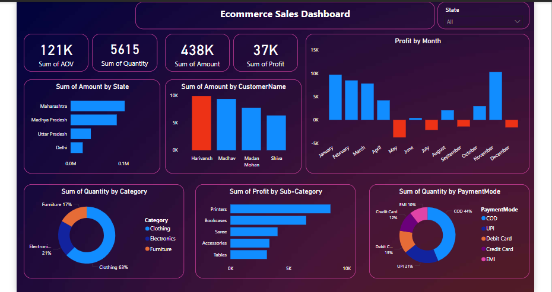

# Ecommerce_Sales_Dashboard

Introduction:

The E-commerce Sales Dashboard is a visual representation of sales data, helping stakeholders analyze key performance indicators (KPIs) such as total revenue, profit, quantity sold, and customer trends. The dashboard provides insights into sales performance across different states, customer segments, product categories, and payment methods.

Objective:

The goal of this dashboard is to help e-commerce businesses track and analyze their online sales across India. By visualizing key metrics, businesses can identify trends, optimize their sales strategy, and improve decision-making.

Project Learnings:

• Created interactive dashboard to track and analyze online sales data.

• Used complex parameters to drill down in worksheet and
customization using filters and slicers.

• Created connections, join new tables, calculations to manipulate
data and enable user driven parameters for visualizations.

• Used different types of customized
visualization (bar chart, pie chart, donut chart,
clustered bar chart, scatter chart, line chart,
area chart, map, slicers, etc).

Conclusion:

The E-commerce Sales Dashboard provides clear insights into sales trends, top-performing products, and customer spending behavior. 

The data suggests:

Maharashtra is the most profitable region.

Clothing is the most sold product category.

COD is the preferred payment method.

Sales and profits peak in specific months, which can guide marketing strategies.
